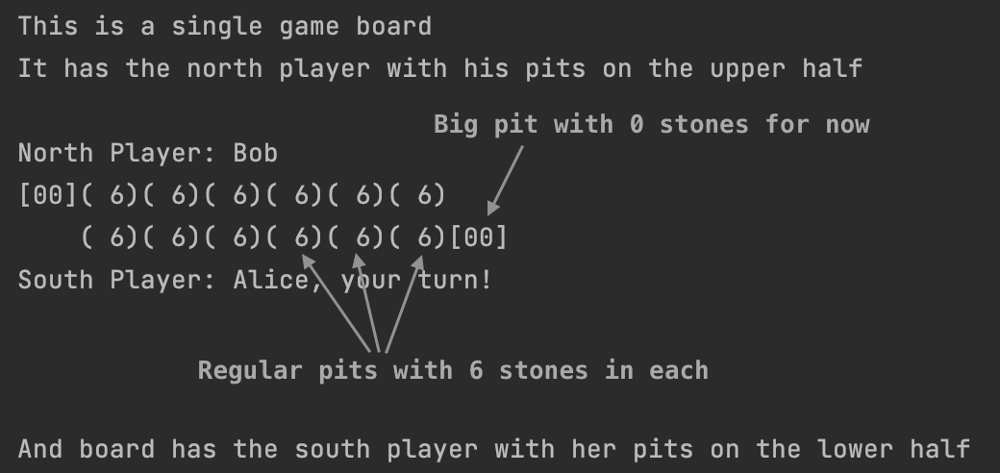
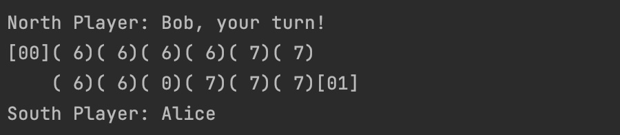

# Intro to the bol.com game

This project represents technical assignment for bol.com with following task:

The purpose of this assignment is to showcase your programming skills. It's not so
much about finishing and solving the problem but about delivering a well-designed
solution with code that makes you proud. Because we would like to judge your
Java skills, we would like you to do this in Java.

The assignment is to program a web application game using frameworks you are
familiar with.

This web application should enable 2 players to play the game (no AI required). It
doesn't need a fancy web interface as we don't need a designer in the team ;-).
However, feel free to make it as fancy as you want, if you want to show off a bit.

While making the test please take the following points into consideration:

- Readability and comprehensibility of the code (Clean code)
- Testing your solution (e.g Unit testing)
- Conscious design/technical decisions

As the purpose of this exercise is to gain insights into how you approach building
software, we do not need you to deliver a finished product with the complete UI. It
should be something you feel comfortable presenting to us and you should be able
to explain the choices you've made along the way.

It should take you approximately 6-8 hours to deliver a solution, but feel free to
spend more time if you feel really excited about it!

We hope you will enjoy working on this assignment, and if you have any
questions please do not hesitate to contact us!

And description of Kalaha game is following.

# My comments

The game was implemented in a form of web based application with a set of REST endpoints:

* POST `/login` - to register a new player and obtain `apiSecret` that is needed for any other request to authenticate
  player. While this approach offers a simplified solution to security, it's sufficient for the scope of this demo
  project.
* POST `/enroll` - to register player's intention to play, backend will look for any other enrolled player and start a
  new game between two.
* GET `/boards` - to list all the boards a player has participated in, including ongoing and finished games.
* GET `/boards/id` - to retrieve the status of a specific board, optimizing network traffic when details for just one
  board are required.
* POST `/boards/{id}/moves` - to record a player's move on a specified board and return the refreshed board status.

I suppose that this collection of methods provides a solid foundation for creating a prototype application and
conducting trial games.

Additionally, here's a hint regarding the domain implementation of the board:  
  
To make a move player have to submit the desired pit index, counting from 0 on his own side from left to right. For
instance, if Alice selects the index `2`, the board's state would transit to the following:  

# TODO list

1) Naturally, any project that advances beyond a demo stage requires robust persistence with a suitable database.
   I'd personally lean towards Postgres as the gold standard. For now, this prototype retains all data in memory.
2) I think this task if a perfect candidate for event sourcing architecture, however it's a bit overkill for a demo
   project.
3) Consistently polling with GET requests from clients isn't optimal. Introducing webhooks with callbacks to notify the
   client when it's their turn again would be a more efficient approach.
4) While doing self-review for the project I realise that according to REST guidelines GET requests should not have
   body, so I should move `apiSecret` to headers and rest of request params to path variables.
5) Both controllers and validation service have multiple code pieces following same pattern, should consider applying
   some refactoring with generics.

# Test deployment